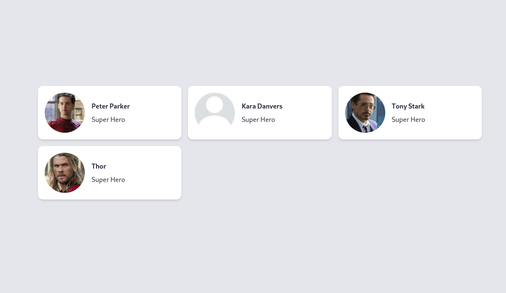

# Vue Profile Picker 
The **Vue Profile Picker** is a sleek VueJS library for choosing profile photos. Its elegant design makes it a perfect choice for integrating photo selection functionality into your VueJS applications

## Installation
You can install VueProfilePicker with just one command and you're good to go
```shell
# with npm
npm i vue-profile-picker

# with yarn
yarn add vue-profile-picker
```
## Initialize Plugin


### Vue.js (globally available)

It is recommended to initialize the plugin in your Vue project's entry file. For projects created with [`@vue/cli`](https://cli.vuejs.org/), this is likely your `main.{js|ts}` file where you are already importing `Vue`.

```ts
// In main.js

import Vue from 'vue'
//1. Import the component
import VueProfilePicker from '@jamesyan20/vue-profile-picker'
// 2. Initialize 
Vue.use(VueProfilePicker)
```

### In-Component (locally available)

Alternatively, you may initialize the component directly within a single file in your project.

```html
<!-- Component -->

<script>
  // Import the profile picker component 
  import VueProfilePicker from '@jamesyan20/vue-profile-picker'

  export default {
    // Register the component
    components: {
      VueProfilePicker,
    },
  }
</script>
```


## Usage

The core usage of the library.

See example in the 'example' folder.


```html
<VueProfilePicker @change="onChange">
	<!-- here goes your component -->
</VueProfilePicker>

<script>
  import VueProfilePicker from '@jamesyan20/vue-profile-picker'
  export default {
    // Register the component
    components: {
      VueProfilePicker,
    },
    methods:{
       onChange(photo){
       		var image = URL.createObjectURL(photo);
        	console.log('here is the img url:  ' + image);	
        }
    }
  }
</script>
```

## Props

| Name | Type | Default value | Description |
| --- | --- | --- | --- |
| title | String or Array | "Choose your Profile Photo" | Custom title option |
| confirm | String | "Okay" | Custom confirm submit text |
| disabled | Boolean | false | Defines whether it is disabled or not |

## Methods

All methods can be chained together.

| Name | Params | Description |
| --- | --- | --- |
| change |  Callback method | Call a callback function. |

